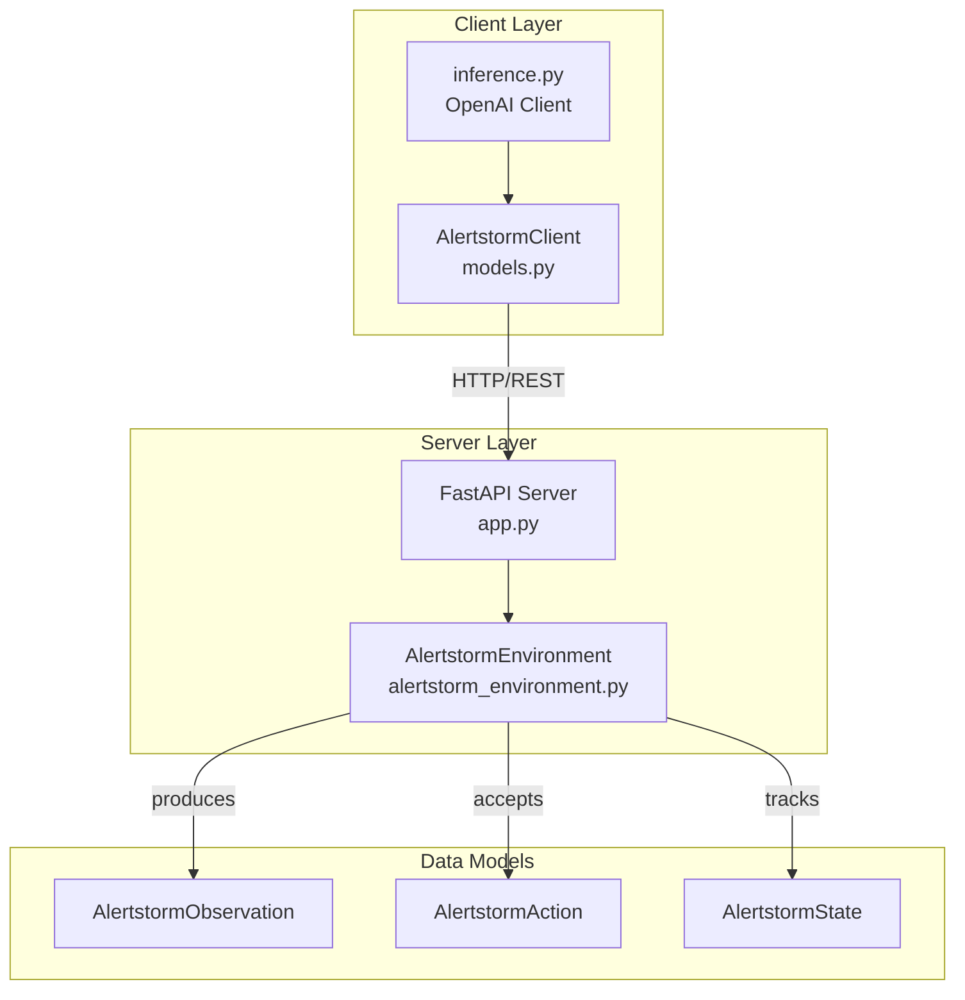
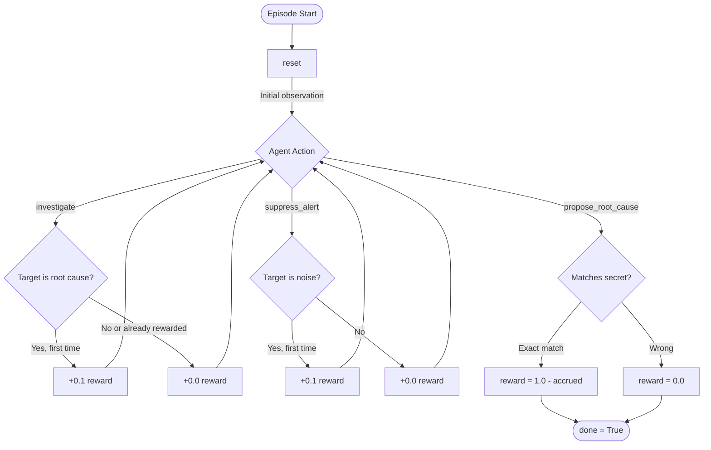
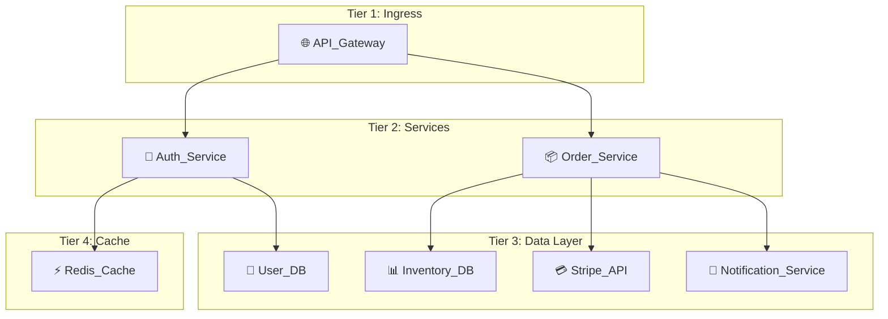
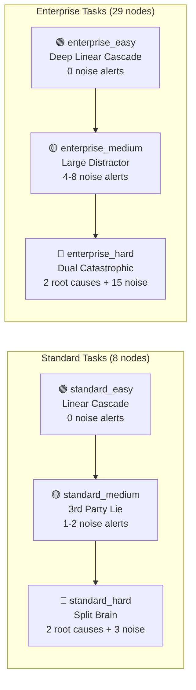
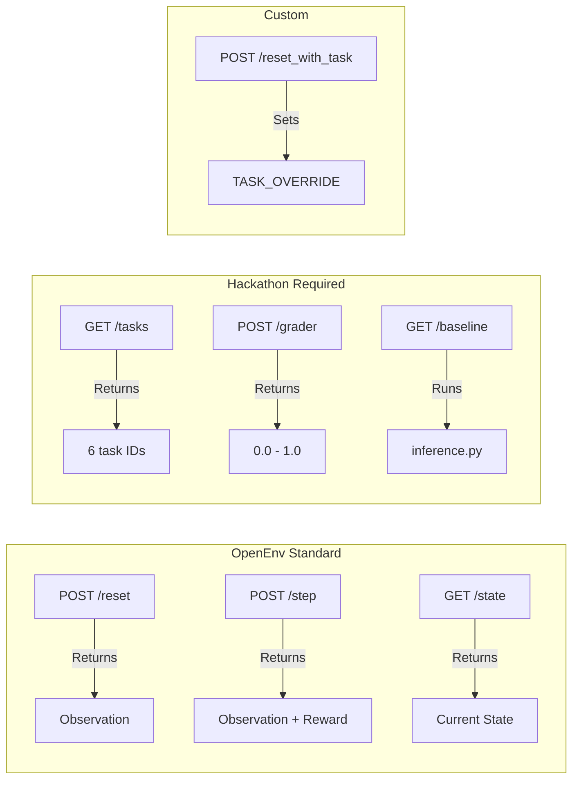

# AlertStorm - OpenEnv SRE Root Cause Analysis Environment

AlertStorm is a real-world OpenEnv environment that simulates cascading failures in microservice architectures.
An agent investigates alerts, suppresses distractor noise, and proposes the true root cause service(s).

## Why this environment

- **Domain:** Site Reliability Engineering (SRE) incident triage and Root Cause Analysis (RCA).
- **The SRE Problem:** Traditional observability tools leave engineers with fragmented analysis—jumping between dashboards, logs, and traces. This reactive, manual hunting extends Mean Time To Resolution (MTTR) from minutes to hours.
- **The RL Solution:** Reinforcement Learning transforms SRE from reactive firefighting to managing self-healing infrastructure. RL models can seamlessly navigate graph-based dependency mappings, automate RCA, and cut resolution times drastically.
- **Utility:** Evaluates agentic reasoning, autonomous observability, and graph-traversal policies under chaotic, noisy telemetry environments.
- **Difficulty progression:** 6 tasks scaling from simple linear cascades to enterprise-level split-brain failures.

## OpenEnv compliance

- Typed models: `AlertstormObservation`, `AlertstormAction`, `AlertstormState`
- Required endpoints: `/reset`, `/step`, `/state`
- Extended endpoints: `/tasks`, `/grader`, `/baseline`, `/reset_with_task`
- Metadata: `openenv.yaml` at repository root

## Tasks

- `standard_easy`: 8-node single root cause cascade
- `standard_medium`: 8-node cascade with noise alerts
- `standard_hard`: 8-node dual root cause split-brain
- `enterprise_easy`: 29-node single root cause cascade
- `enterprise_medium`: 29-node enterprise distractor scenario
- `enterprise_hard`: 29-node dual root cause split-brain

## Project layout

- `alertstorm/server/alertstorm_environment.py`: environment logic and reward shaping
- `alertstorm/server/app.py`: FastAPI server and OpenEnv app
- `alertstorm/models.py`: typed Pydantic models
- `inference.py`: required root-level baseline inference entrypoint
- `alertstorm/test_llms.py`: multi-provider benchmarking helper

## Environment variables

Required for baseline inference:

- `API_BASE_URL` (example: `https://router.huggingface.co/v1`)
- `MODEL_NAME` (example: `meta-llama/Meta-Llama-3-8B-Instruct`)
- `HF_TOKEN`

Optional for benchmarking script:

- `GROQ_API_KEY`
- `TOGETHER_API_KEY`
- `OPENROUTER_API_KEY`

The latter mentioned three variables are not needed for submission.

## Action and Observation Spaces

Action space (`AlertstormAction`):

- `action_type`: one of `investigate`, `suppress_alert`, `propose_root_cause`
- `targets`: list of service names to act on
- `confidence` (optional): float in [0.0, 1.0]

Observation space (`AlertstormObservation`):

- `active_alerts`: list of alert objects (id, service, type, timestamp, noise metadata)
- `dependency_graph`: service dependency mapping for the active topology
- `recent_logs`: latest investigation/grading log text

State space (`AlertstormState`, internal):

- `task_level`, `secret_root_causes`, `active_alerts`, `suppressed_alerts`, `time_elapsed`, `step_count`

## Local setup

```bash
pip install -r requirements.txt
uvicorn alertstorm.server.app:app --host 0.0.0.0 --port 8000
```

## Run baseline (submission script)

```bash
python inference.py
```

## Run multi-LLM benchmark

```bash
python alertstorm/test_llms.py
```

Results are saved to `benchmark_results.json`.

## Validation checklist

1. `openenv validate`
2. `docker build -t alertstorm-env .`
3. `python inference.py`
4. `python alertstorm/test_llms.py` (with provider keys configured)

## Docker

The repository root `Dockerfile` starts the OpenEnv FastAPI server on port `8000`:

```bash
docker build -t alertstorm-env .
docker run --rm -p 8000:8000 alertstorm-env
```

## Baseline Benchmark Scores (April 2026)

The environment was thoroughly evaluated against frontier, medium, and edge AI LLMs across all 6 scenarios (Standard 8-node and Enterprise 29-node grids). 

Enforcing strict validation: models must natively traverse the JSON dependency payload and identify the failing leaf node. Zero data leaks exist (all failures present identically as `Response Timeout / 500 Error`). 

The grader provides continuous signals: Correctness (`0.75`), Micro-Progress/Investigation (`0.15`), and Step Efficiency (`0.10`). A model intelligently investigating a telemetry alert before proposing the true root cause earns an ultimate score of `1.00`. Models that fail to propose root cause within step limits or hallucinate invalid nodes score `0.00`.

| Model / Provider | Standard Easy | Standard Medium | Standard Hard | Enterprise Easy | Enterprise Medium | Enterprise Hard | **AVG** |
|------------------|---------------|-----------------|---------------|-----------------|-------------------|-----------------|---------|
| **Llama 3.3 70B Versatile (Groq)** | 1.00 | 1.00 | 1.00 | 1.00 | 1.00 | 1.00 | **1.00** |
| **Qwen3.6 Plus Free (OpenRouter)** | 1.00 | 1.00 | 1.00 | 1.00 | 1.00 | 1.00 | **1.00** |
| **Nemotron 3 Super 120B (NVIDIA Build)** | 1.00 | 1.00 | 0.10 | 1.00 | 1.00 | 0.00 | **0.68** |
| **DeepSeek V3 (HuggingFace)** | 1.00 | 1.00 | 0.40 | 1.00 | 0.30 | 0.00 | **0.62** |
| **Meta Llama 3 8B Instruct (HuggingFace)** | 0.85 | 0.85 | 0.10 | 0.85 | 0.10 | 0.10 | **0.47** |
| **GPT-4o-mini (OpenAI)** | 0.89 | 0.85 | 0.10 | 0.85 | 0.10 | 0.00 | **0.46** |
| **Gemini 1.5 Flash (Google AI Studio)** | 0.89 | 0.85 | 0.10 | 0.85 | 0.00 | 0.00 | **0.45** |
| **Llama 3.1 8B Instant (Groq)** | 0.89 | 0.89 | 0.00 | 0.00 | 0.00 | 0.00 | **0.36** |
| **GPT-OSS 20B (Groq)** | 1.00 | 0.00 | 0.00 | 0.00 | 0.00 | 0.00 | **0.17** |

> **Note:** Scores naturally vary per run due to procedural generation. To align with Hackathon goals evaluating true agentic reasoning, we replaced our early deterministic fallback solver (which originally achieved 40-60% base success) with dynamic 'Action History' prompt injection. Agents must now autonomously break out of loops using their history, meaning benchmark reproductions will fluctuate as models are evaluated entirely on their own merit.

## Architecture Diagrams

### System Overview



### Reward Signal Flow



### Standard Topology: Goldilocks Graph (8 Nodes)



### Task Difficulty Progression



### API Endpoints Reference


