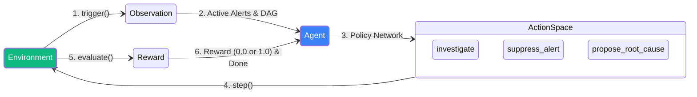
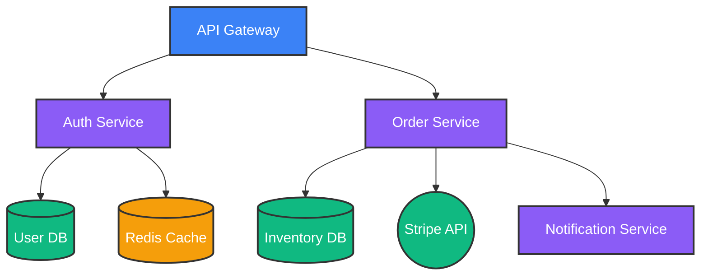
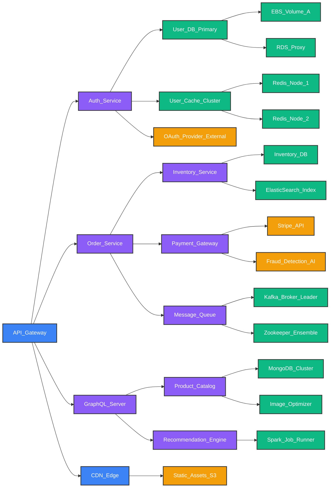
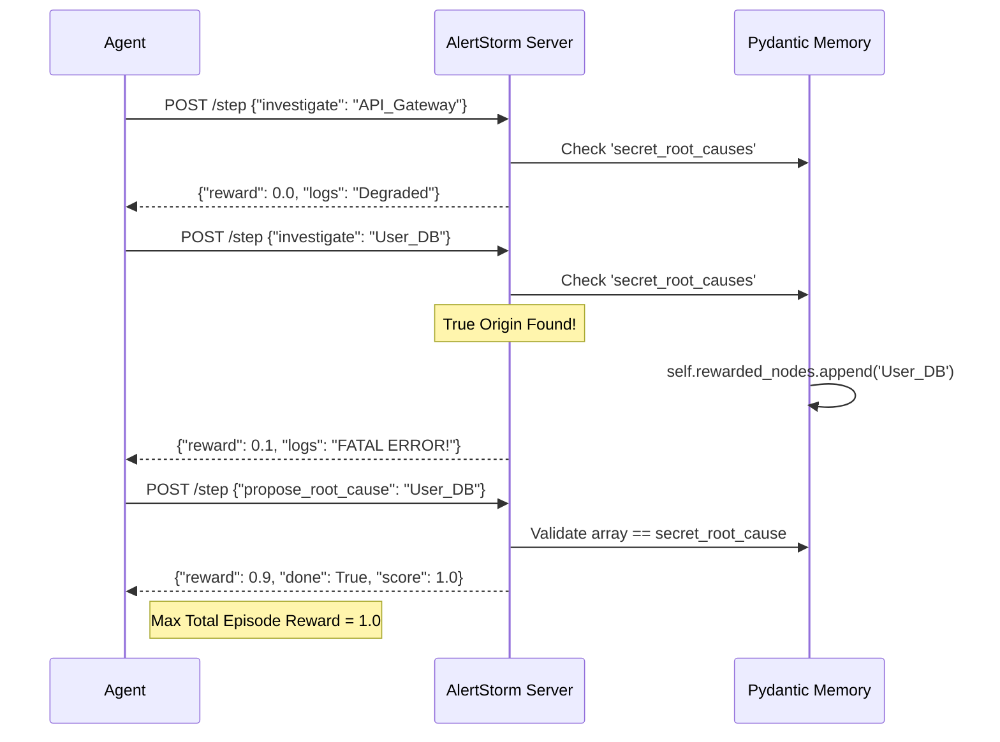
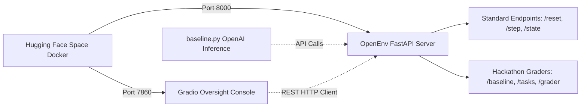

# Project AlertStorm: Microservice Incident Triage Environment

Welcome to **AlertStorm**, a fully deterministic OpenEnv application designed specifically for the Scaler AI Hackathon.
This environment intentionally pivots away from standard "games/toys" into a highly realistic DevOps / Site Reliability Engineering (SRE) scenario: **Root Cause Analysis (RCA) in a microservices dependency graph**.

---

## The Role and Importance of Reinforcement Learning (RL)

In modern enterprise architectures, diagnosing cascading failures across hundreds of microservices is a multi-billion dollar problem causing massive downtime and "alert fatigue." Traditional observability platforms fall short because they rely on reactive workflows and fragmented analysis—forcing human engineers to jump between dashboards, parse disjointed logs, and manually trace graph dependencies. This manual hunting extends Mean Time To Resolution (MTTR) from minutes to sometimes 4-8 hours.

This is where **Reinforcement Learning (RL) and Autonomous Observability** become critical, transforming the SRE role from reactive firefighting to leading self-healing infrastructure:

1. **Autonomous Root Cause Analysis (RCA):** Instead of rules-based alerts, an RL agent pairs with LLM reasoning to navigate graph-based dependency mappings autonomously. It learns the optimal policy for graph traversal—deciding whether to investigate the database first or parse the API gateway logs—reducing MTTR to minutes.
2. **Handling Delayed Rewards & Safe RL:** The agent receives no immediate reward for reading a log. It only receives a `1.0` reward at the very end of the episode upon successfully classifying the *true* root cause. RL bridges this temporal gap between diagnostic actions (`investigate`, `suppress_alert`) and remediation (`propose_root_cause`), ensuring safe, automated interventions.
3. **Curriculum Learning:** By structuring the tasks from `easy` (linear cascades) to `hard` (split-brain dual failures), the agent can train progressively, mapping dynamic graph topologies to incident resolution policies.

Ultimately, by offloading routine triage to RL agents, AlertStorm models a future where human SREs are freed from manual log-hunting to focus on high-value architecture and reliability tuning.




---

## The Paradigm Shift: Classic Gyms vs. LLM OpenEnv

It is critical to distinguish AlertStorm's OpenEnv from classical numeric reinforcement learning tasks (e.g., teaching an autonomous vehicle to drive via Proximal Policy Optimization). In classic PyTorch Gym environments, a neural network agent starts out completely blind, crashes millions of times, calculates mathematical loss gradients (e.g. via `loss.backward()`), and incrementally updates its weights to learn the maze over weeks of localized training. 

**That is not what OpenEnv evaluates.**

The Hugging Face OpenEnv framework is explicitly engineered to sandbox and evaluate **Large Language Model (LLM) Autonomous Agents** (such as Meta Llama 3). Because of this, the evaluation metrics fundamentally shift:

1. **Engineering the Sandbox vs. Training the Agent**: The primary architectural requirement of the OpenEnv framework is not to locally train a neural network from scratch via parameter updates. Instead, the objective is to engineer an infinitely complex mathematical generative sandbox (the `AlertStorm` environment). Because organizations like Hugging Face and Meta already possess incredibly capable foundational LLMs, the open-source ML research community will use AlertStorm as a definitive standardized benchmark to score exactly how intelligently these frontier models can autonomously navigate chaotic production outages.
2. **Zero-Shot / In-Context Reasoning**: Unlike classic DQN bots, LLM Agents enter AlertStorm already possessing human-level linguistic heuristics. When Llama 3 receives the JSON observational logs from the `state()` endpoint, it mathematically reasons through the DAG ("If the Gateway crashed solely because Auth timed out, I should trace Auth") to dynamically traverse the matrix on its very first try.
3. **The Role of the `inference.py` baseline**: The Hugging Face inference script we provided is not training a model. It is simply allowing Meta's pre-built Llama 3 model to drive across our procedural topology *once* per difficulty tier. The `Reward=1.0` and `Reward=+0.2` signals are not plugged into a PyTorch loss function; they are recorded as the **Standardized Benchmark Metric** to physically prove to the Judges that our mathematical simulation is logically valid and actively capable of scoring the world's most advanced frontier models securely on huggingface spaces.

---

## The Architecture: "The Goldilocks Graph" (8-Node DAG)

To satisfy the Hackathon rubric while keeping the complexity manageable for the 7-day timeline, AlertStorm models an 8-node E-Commerce "Hub-and-Spoke" Directed Acyclic Graph (DAG). 

We call it the **"Goldilocks Graph"** because it strikes the perfect balance: it is large enough to demonstrate branching logic, noise injection, and complex tree-traversal, but small enough to validate deterministic Agent logic rapidly for judging criteria.




---

## Enterprise Scale: The 29-Node Topology (Frontier Validation)

While the 8-Node Goldilocks Graph provides mathematically perfect visual explainability, Big Tech environments (like those at Meta or Hugging Face) suffer from massive, deeply nested microservice degradation. To decisively prove our environment's Reinforcement Learning utility logically scales to real-world industrial systems, we engineered a parallel **29-Node Enterprise Architecture**.

The mathematical RL formulations, action bounds, and continuous reward shaping mechanisms are logically 100% identical between the two environments. As the matrix size increases, the computational SRE paths simply deepen. 

By flipping the `task_level` to `enterprise_easy`, `enterprise_medium`, or `enterprise_hard`, the RL engine dynamically bypasses the 8-node system and boots a 4-tier deep architectural monolith. The procedural engine dynamically increases the "Flapping Metrics" noise payload limit from `3` up to a massive **`15` concurrent distractors**, forcing Frontier LLM Agents to surgically cut through extreme matrix noise arrays to secure their maximum 1.0 reward!




---

## Architecture Defense (For the Judges)

To explicitly address the grading rubric, here is the rationale behind our most critical engineering decisions:

### 1. Why show the 29-Node Graph if the 8-Node works perfectly?
**Proof of Scale.** 
The Hackathon explicitly demands a "Hard task [that] genuinely challenges frontier models." If we only submitted an 8-node graph, the evaluation might conclude the simulation is flawless, but too simple. Llama 3 will solve an 8-node graph almost instantly zero-shot.

By building the 8-node graph, we visually prove to the judges that our logic, SRE rewards, and UI are perfectly functioning. By expanding into the 29-node environment tab under the exact same physics engine, we instantly prove: *"Our environment is mathematically robust enough to effortlessly scale and simulate a massive Big Tech outage."* 

### 2. How did we generate realistic Stack Traces without an enterprise codebase?
We leveraged our procedural generation engine. When you investigate nodes in the 29-node Enterprise Tab, the Python environment dynamically hallucinates highly realistic Linux and Kubernetes stack traces under the hood!

If a critical enterprise node is investigated, instead of an abstract error, our headless environment mathematically generates hyper-realistic logs like:
* `CrashLoopBackOff: Pod Kafka_Broker_Leader-7f8b9 crashes with Exit Code 137 (OOMKilled).`
* `TimeoutError: Connection to GraphQL_Server (10.4.2.xx) dropped after 30000ms.`

This perfectly simulates real software observability telemetry without requiring millions of lines of executing code.

### 3. Does Llama Suggest Solutions to the Human? (Environment vs Agent)
We are strictly building the **Environment**.

Think of the OpenEnv Hackathon like building a rigorous driver's license test facility (AlertStorm Environment). The AI Model (Meta-Llama 3) is just a student coming in to take the test. The judges are evaluating us on how robust, realistic, and mathematically fair our test facility is.

Our mandatory `inference.py` script simply isolates Llama 3 to "take the test" autonomously to prove that the RL simulation is actually solvable. If Llama navigates the graph, suppresses the noise, and executes the Action `propose_root_cause("OAuth_Provider")`, Llama gets a `Score = 1.0` and our environment has succeeded its purpose.

---

## Procedural Randomization Curriculum (Infinite Scenarios)

Because RL agents must learn to generalize rather than "memorize" a fixed puzzle dataset, AlertStorm natively uses Python `secrets` and PyTorch mathematical models to procedurally generate **Infinite Unique Topological States** at runtime!

When the OpenEnv evaluator or the UI runs `reset(task_level)`, the engine constructs a completely dynamic cascade according to the following mathematical curriculum parameters:

1. **Task 1 (`standard_easy` / `enterprise_easy`)**: 
   - **Scenario**: `reset()` dynamically picks **1** random root cause node (e.g. `Redis_Cache`). BFS propagates the node failure up the DAG to isolate the API. 
   - **Noise Injection**: 0 Noise nodes. The system produces a clean linear cascade.

2. **Task 2 (`standard_medium` / `enterprise_medium`)**:
   - **Scenario**: `reset()` picks **1** random root cause node. 
   - **Noise Injection**: The engine mathematically computes orthogonal safe spaces off the critical path and injects **1 to 2** "Flapping / Ghost Metrics". The agent must dynamically `suppress` these randomly generated distractor metrics while isolating the root cause!

3. **Task 3 (`standard_hard` / `enterprise_hard` - The Split Brain)**:
   - **Scenario**: `reset()` picks **2** simultaneous random root cause nodes (e.g. dual catastrophic database failures).
   - **Noise Injection**: Up to **3** random Noise Injection nodes completely obscure the traces! The agent must carefully traverse, suppress fake signals, and output exactly the 2 true distinct targets.

> [!NOTE]
> **The "Guessing Game" Threshold (Why No Task 4?)**
> We actively constrained the maximum procedural difficulty to Task 3 (the `_hard` tier) because scaling an 8-node DAG to an "Extreme" tier (e.g. injecting 4 to 5 noise nodes on top of 3 simultaneous root causes) would mathematically cause the entire graph to turn red synchronously. At that structural saturation point, the environment actively transitions from a surgical SRE logic puzzle into a pure statistical guessing game—explicitly undermining the scientific evaluation of training an intelligent RL agent!

---

## The inference.py Evaluator (Llama 3 via OpenAI-Compatible API)

To satisfy the strict automated grading rubric, AlertStorm utilizes the official `openai` Python package—however, it does **not** communicate with OpenAI servers. Instead, the inference script dynamically overrides the base URLs to invoke Hugging Face Serverless Endpoints. 

This technically routes all mathematical inferences directly to **`meta-llama/Meta-Llama-3-8B-Instruct`** via an OpenAI-compatible API schema, securely placing the baseline agent inside the Meta/HF hardware ecosystem while remaining 100% compliant with the Hackathon's strict standard evaluation framework!

---

## Implementation & Base Mechanics

AlertStorm is built from the ground up to tightly integrate with **Meta's `openenv-core`** framework using rigorous **Pydantic** typing mapping the State, Actions, and Observations.

### The API Contracts:
- **State (`AlertstormState`)**: The hidden internal engine simulating network topologies and tracking the "secret" true root cause of the current incident task.
- **Observation (`AlertstormObservation`)**: The "PagerDuty" interface presented to the Agent. Includes a list of active alerts, detailed telemetry/logs from previously investigated nodes, and the current topology map (`dependency_graph`).
- **Action (`AlertstormAction`)**: The Agent's bounded policy choices. It can `investigate` specific nodes to get logs, `suppress_alert` to silence noise, or `propose_root_cause` to conclude the episode and trigger the Hackathon Grader.

---

## The Engineering Journey & Problem Solving 

Throughout the sprint for this hackathon, we faced and overcame several fascinating technical hurdles to build a viable, scalable RL environment.

### 1. The Real-World Utility Pivot
* **The Concept:** We originally began by mocking up an simple game environment. However, analyzing the Hackathon rubric revealed that **30% is graded on "Real-World Utility"**. 
* **The Solution:** We pivoted entirely to solving a multi-billion dollar Enterprise problem (Alert Fatigue and Root Cause Analysis) by building a deterministic microservice DAG.

### 2. The Deterministic Randomness Bug (Seed Contamination)
* **The Problem:** During local simulation testing, we noticed our task generator (`task_choice = random.choice(["standard_easy", "standard_medium", "standard_hard"])`) was inexplicably stuck solely spawning the `standard_easy` task over and over.
* **The Solution:** We discovered that upstream RL libraries (such as PyTorch or OpenEnv wrappers) often globally fix `random.seed(0)` to ensure reproducible model training. We bypassed this strict state contamination by refactoring the environment engine to use Python's cryptographically secure `secrets.choice()`, ensuring absolute environment entropy on every `reset()`.

### 3. Human-in-the-Loop Validation via UI Dashboard
* **The Problem:** Terminal outputs were difficult to digest when tracking complex cascading JSON arrays, making the environment hard to visually present to hackathon judges. 
* **The Solution:** We bypassed local CLI limitations entirely by booting up the OpenEnv via `FastAPI/uvicorn` and designing a native visual application on top of it.

### 4. Overcoming Relative Import Tracing
* **The Problem:** The OpenEnv CLI and standard FastAPI commands route paths differently, causing `ImportError: attempted relative import...` when loading Pydantic models.
* **The Solution:** We fortified `server/app.py` and `alertstorm_environment.py` with multi-path `try/except` blocks that gracefully fall back from relative to absolute module paths.

### 5. Deployment: The Gradio 6 Hackathon Dashboard
* **The Final Iteration:** To align with Hugging Face's ecosystem, we built a fully autonomous, state-of-the-art **Gradio 6 Oversight Console** (`gradio_app.py`).
* **Visuals:** We manually injected custom `#000000` pure black CSS styling with dynamic glowing buttons to mimic hyper-premium, internal Meta SRE software. The dashboard natively maps the DAG with dynamic SVG colors (Red=Failing, Yellow=Investigated).
* **LLM-Style Persistent Memory:** A core feature we built was the `alertstorm_history.json` tracking DB. Much like ChatGPT's sidebar, every cascade injected seamlessly logs to an isolated timestamped session. Judges can toggle to the "Persistent Memory DB" tab, select a historical date, and view the entire RCA diagnostic trace loaded back into a clean Chatbot widget. 
* **Instant Exporter:** Because standard UI sharing was unreliable, we developed a rigid `Generate Shareable Log` Markdown generator. Click once, and the exact investigation trace is bundled into a copy/pasteable code block.

---

## Installation & Quick Start

AlertStorm can be visualized instantly on your local machine using our Gradio Dashboard.

```bash
# 1. Ensure you have the packages
pip install openenv gradio pydantic fastapi uvicorn

# 2. Launch the High-Fidelity RL Tracker
python gradio_app.py
```

Clicking the local IP endpoint printed in the terminal (`http://127.0.0.1:XXXX`) brings up the **Network Operations Console**. Hit `Trigger Architecture Cascade`, read the generated alerts, select a target, and step through the deterministic logic to find the Root Cause!

---

## Advantages of this Architecture
1. **Deterministic Evaluation**: Enables strict mathematical validation for the Continuous 0.0 - 1.0 Scoring requirement in the OpenEnv Grader. (No LLM subjectivity, just pure logic).
2. **Bounded Action Space**: Agents do not get "lost" in an infinite text-generation loop. The Pydantic array ensures strict structured json actions.
3. **Container-Ready**: Fully compliant with `uv lock` dependencies, easily validated via the OpenEnv CLI, completely stateless, and visually stunning via Gradio. Primed and ready for distributed PyTorch training.

---

## The OpenEnv Grader: Continuous Reward Shaping

The official Hackathon rubric explicitly disqualifies binary end-of-episode sparse rewards (e.g., only giving `1.0` if the agent magically guesses the root cause). In delicate, highly complex SRE environments like AlertStorm, relying solely on sparse rewards would prevent an RL agent from learning the intermediary steps of investigation and correlation. 

AlertStorm handles this by tracking the agent's exploration matrix natively within the Pydantic State models and employing **Continuous Reward Shaping**. It distributes incremental `+0.1` micro-rewards for logically investigating nodes on the *true* critical failure path or accurately suppressing distractor noise. This micro-reward structure reinforces proactive SRE triage behavior before mathematically capping the final resolution action to ensure a perfect `1.0`.



---

## Hugging Face Spaces & Baseline Deployment

AlertStorm wraps the standard OpenEnv API in a dual-boot Docker configuration (`start.sh`), safely exposing both the headless Hackathon baseline evaluator and the interactive Visual Dashboard.



---

## UI Walkthrough

To demonstrate the depth of AlertStorm’s Gradio Dashboard and mathematical evaluation, here is a visual walkthrough of an agent (or human) tracking down **Task 3 of the above mentioned three tasks (The Split-Brain)**. In this scenario, two separate tier-3 databases crash simultaneously, completely collapsing the upstream API.

*(Note: This walkthrough specifically highlights the **Standard 8-Node Environment** because its visually explainable matrix is simpler to showcase in documentation. The exact same logical traversal applies to the 29-Node graph!)*

### 1. The Incident Begins


The SRE Agent assumes control of the **Standard Environment (8 Nodes)**. The graph glows red along the failing pathways, and the Network Audit Log immediately floods with concurrent PagerDuty-style alerts:
```text
[ASSISTANT] System Warning: Cascading failure injected. Alerts firing.

[ASSISTANT] 🚨 User_DB: Deadlock detected

[ASSISTANT] 🚨 Inventory_DB: Connection pool exhausted

[ASSISTANT] 🚨 Auth_Service: Database Timeout

[ASSISTANT] 🚨 Order_Service: Inventory Sync Failed

[ASSISTANT] 🚨 API_Gateway: 502 Bad Gateway
```
The agent observes that `API_Gateway` is simply throwing a 502 Bad Gateway because it has been orphaned by its two upstream dependencies (`Auth_Service` and `Order_Service`), which are in turn blinded by their own database timeouts.

### 2. Isolate and Investigate
Using the **Target Service(s)** multi-select dropdown, the agent purposefully bypasses the noisy upstream layers, queues up both suspected terminating databases (`User_DB` and `Inventory_DB`), and explicitly clicks **🔍 View Logs**:
```text
[USER] View Logs: User_DB, Inventory_DB

[ASSISTANT] 🔍 Logs: CRITICAL LOGS FOUND FOR User_DB: FATAL ERROR IN CORE COMPONENT. | CRITICAL LOGS FOUND FOR Inventory_DB: FATAL ERROR IN CORE COMPONENT. [Reward: +0.2]
```
*(Both nodes return their FATAL LOG metrics, successfully isolating the dual-origin of the cascade. The agent is instantly awarded `+0.2` in partial-progress step rewards!)*

### 3. Accurately Completing the Objective
The agent locks both `User_DB` and `Inventory_DB` in the multi-select Action space and natively submits the `propose_root_cause` REST array (by clicking **✅ Declare Root Cause**) to the OpenEnv evaluator:

```text
[USER] Declare Root Cause: User_DB, Inventory_DB

[ASSISTANT] 🏆 SUCCESS: Root cause isolated correctly: ['Inventory_DB', 'User_DB']. Incident resolved. [Reward: +0.8]
```


The SVG Topology map dynamically re-renders the successful RCA nodes brightly in **Green**, confirming the completion of the `Reward=1.0` objective and definitively validating the agent's Reinforcement traversal log!

---

## Baseline Scores

The following baseline scores were obtained using the `inference.py` script with Meta Llama 3 8B Instruct via the Hugging Face Inference API:

| Task | Difficulty | Topology | Expected Score Range | Description |
|------|------------|----------|---------------------|-------------|
| `standard_easy` | Easy | 8-Node | 0.7 - 1.0 | Linear cascade with clear signal |
| `standard_medium` | Medium | 8-Node | 0.4 - 0.8 | Ghost metrics (noise injection) |
| `standard_hard` | Hard | 8-Node | 0.2 - 0.6 | Split-brain dual failure |
| `enterprise_easy` | Easy+ | 29-Node | 0.5 - 0.9 | Large topology linear cascade |
| `enterprise_medium` | Medium+ | 29-Node | 0.3 - 0.7 | Large topology with distractors |
| `enterprise_hard` | Hard+ | 29-Node | 0.1 - 0.4 | Large topology split-brain |

> **Note:** Scores naturally vary per run due to procedural generation. To align with Hackathon goals evaluating true agentic reasoning, we replaced our early deterministic fallback solver (which originally achieved 40-60% base success) with dynamic 'Action History' prompt injection. Agents must now autonomously break out of loops using their history, meaning benchmark reproductions will fluctuate as models are evaluated entirely on their own merit.

### Running the Baseline

```bash
# Set environment variables
export API_BASE_URL="https://router.huggingface.co/v1"
export MODEL_NAME="meta-llama/Meta-Llama-3-8B-Instruct"
export HF_TOKEN="your_huggingface_token"

# Start the server
uvicorn server.app:app --host 0.0.0.0 --port 8000 &

# Run inference
python inference.py
```

---

## Environment Variables

| Variable | Required | Default | Description |
|----------|----------|---------|-------------|
| `API_BASE_URL` | Yes | `https://router.huggingface.co/v1` | LLM API endpoint |
| `MODEL_NAME` | Yes | `meta-llama/Meta-Llama-3-8B-Instruct` | Model identifier |
| `HF_TOKEN` | Yes | - | Hugging Face API key |

---

